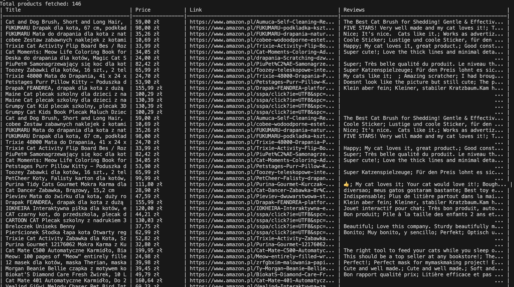

# Ruby Crawler

## Overview

This project is a Ruby-based web crawler designed to scrape product details from Amazon. It utilizes the `Nokogiri` library for parsing HTML and `Sequel` for interacting with an SQLite database.

---

## Features

### Core Functionality
1. **Basic Product Data Retrieval**  
   Fetch product details like title, price, and product link based on a keyword search.
   
2. **Keyword-Based Search**  
   Dynamically search for products using user-provided keywords.

3. **Extended Product Details**  
   Retrieve reviews from the product's detail page.

4. **Product Links**  
   Save links to individual product pages for future reference.

5. **Database Integration**  
   Store all fetched product data in an SQLite database using the `Sequel` library.

___

## Usage

1. Run the program:
    ```
    ruby Main.rn
    ```

2. Enter the key word
    ```
    Enter a search word: laptop
    ```

3. View the results
   


